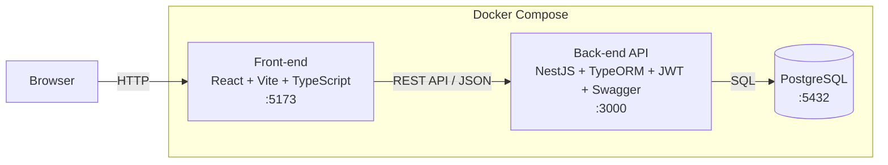
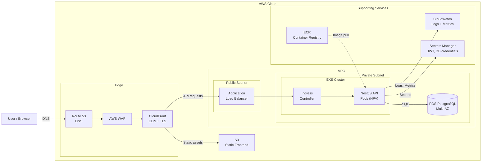

# Teddy Open Finance Challenge

MVP full-stack de um sistema de clientes com login, CRUD, listagem, detalhes e dashboard administrativo. Monorepo Nx com React + Vite no frontend e NestJS no backend, pronto para rodar localmente via Docker.

## Demo em produção

A aplicação está publicada e pode ser testada diretamente no navegador:


| Serviço                           | URL                                                                                                                    |
| --------------------------------- | ---------------------------------------------------------------------------------------------------------------------- |
| **Aplicação (frontend)**          | [https://teddy-open-finance-challenge-red.vercel.app](https://teddy-open-finance-challenge-red.vercel.app)             |
| **API (backend)**                 | [https://teddy-open-finance-challenge.onrender.com](https://teddy-open-finance-challenge.onrender.com)                 |
| **Swagger (documentação da API)** | [https://teddy-open-finance-challenge.onrender.com/docs](https://teddy-open-finance-challenge.onrender.com/docs)       |
| **Health check**                  | [https://teddy-open-finance-challenge.onrender.com/healthz](https://teddy-open-finance-challenge.onrender.com/healthz) |
| **Métricas (Prometheus)**         | [https://teddy-open-finance-challenge.onrender.com/metrics](https://teddy-open-finance-challenge.onrender.com/metrics) |


**Credenciais**: `admin@teddy.com` / `password123`

> **Nota sobre o backend**: O deploy utiliza o free tier do Render como hospedagem de MVP. O serviço entra em suspensão após 15 minutos de inatividade — o primeiro acesso pode levar ~30 segundos para o servidor acordar. Após o primeiro request, a navegação é fluida. O frontend está na Vercel e responde instantaneamente.

## Diagrama de arquitetura




> Versão detalhada com módulos internos: veja o README de cada app ([back-end](./apps/back-end/README.md), [front-end](./apps/front-end/README.md))
>
> Versão em imagem: [docs/architecture.png](./docs/architecture.png)

## Pré-requisitos

- Docker e Docker Compose

## Como rodar

### Stack completa (recomendado)

```bash
cp .env.example .env
docker compose up --build
```

Aguarde os 3 containers subirem. O PostgreSQL precisa estar healthy antes do backend iniciar — o Docker Compose cuida disso automaticamente.


| Serviço      | URL                                                            |
| ------------ | -------------------------------------------------------------- |
| Frontend     | [http://localhost:5173](http://localhost:5173)                 |
| Backend API  | [http://localhost:3000](http://localhost:3000)                 |
| Swagger      | [http://localhost:3000/docs](http://localhost:3000/docs)       |
| Health check | [http://localhost:3000/healthz](http://localhost:3000/healthz) |
| Métricas     | [http://localhost:3000/metrics](http://localhost:3000/metrics) |


### Apps isolados

Cada app pode ser executado independentemente com seu próprio `docker-compose.yml`:

```bash
cd apps/back-end && docker compose up --build    # backend + postgres
cd apps/front-end && docker compose up --build   # frontend (requer backend rodando)
```

### Credenciais padrão


| Email             | Senha         |
| ----------------- | ------------- |
| `admin@teddy.com` | `password123` |


Usuário criado automaticamente via seed quando o banco está vazio. Além disso, 67 clientes de exemplo são inseridos automaticamente na primeira execução, com nomes, salários, valores de empresa e datas de cadastro variados.

### Modo de desenvolvimento

Para debugging, hot reload e desenvolvimento ativo:

```bash
npm install
cp .env.example .env
docker compose up -d postgres       # apenas o banco
npm run dev:back                     # backend com hot reload (terminal 1)
npm run dev:front                    # frontend com hot reload (terminal 2)
```

## Scripts disponíveis


| Comando                | Descrição                           |
| ---------------------- | ----------------------------------- |
| `npm run dev:front`    | Dev server do frontend (hot reload) |
| `npm run dev:back`     | Dev server do backend (hot reload)  |
| `npm run build:front`  | Build do frontend para produção     |
| `npm run build:back`   | Build do backend para produção      |
| `npm run test:front`   | Testes do frontend                  |
| `npm run test:back`    | Testes do backend                   |
| `npm run test`         | Todos os testes                     |
| `npm run lint`         | Lint de todos os projetos           |
| `npm run format`       | Formatar código                     |
| `npm run format:check` | Verificar formatação                |


## Endpoints da API


| Método | Rota                 | Auth | Descrição                     |
| ------ | -------------------- | ---- | ----------------------------- |
| POST   | `/auth/login`        | Não  | Autenticação (retorna JWT)    |
| GET    | `/clients`           | Sim  | Listar clientes               |
| POST   | `/clients`           | Sim  | Criar cliente                 |
| GET    | `/clients/dashboard` | Sim  | Stats do dashboard            |
| GET    | `/clients/:id`       | Sim  | Detalhe (incrementa contador) |
| PUT    | `/clients/:id`       | Sim  | Atualizar cliente             |
| DELETE | `/clients/:id`       | Sim  | Soft delete                   |
| GET    | `/healthz`           | Não  | Health check                  |
| GET    | `/metrics`           | Não  | Métricas Prometheus           |
| GET    | `/docs`              | Não  | Swagger                       |


## Escopo funcional

- Autenticação (e-mail/senha) com JWT
- CRUD de clientes com soft delete
- Dashboard: totais, últimos clientes e gráfico mensal
- Contador de acessos no detalhe do cliente
- Auditoria com timestamps (`createdAt`, `updatedAt`, `deletedAt`)

## Stack

### Frontend (`apps/front-end`)


| Lib                      | Uso                                   |
| ------------------------ | ------------------------------------- |
| React 19                 | UI com hooks e componentes funcionais |
| Vite                     | Build e dev server                    |
| TypeScript               | Tipagem estrita                       |
| React Hook Form          | Formulários com validação             |
| React Router             | Roteamento e URL state                |
| Recharts                 | Gráfico de barras no dashboard        |
| Tailwind CSS             | Estilização                           |
| Vitest + Testing Library | Testes de componente                  |


### Backend (`apps/back-end`)


| Lib                         | Uso                       |
| --------------------------- | ------------------------- |
| NestJS 11                   | Framework modular         |
| TypeORM                     | ORM com PostgreSQL        |
| PostgreSQL 16               | Banco de dados            |
| Passport + JWT              | Autenticação              |
| class-validator             | Validação de DTOs         |
| class-transformer           | Transformação de payloads |
| bcrypt                      | Hash de senhas            |
| Swagger (`@nestjs/swagger`) | Documentação de API       |
| Jest                        | Testes unitários          |


### Monorepo e qualidade


| Lib          | Uso                                     |
| ------------ | --------------------------------------- |
| Nx 20        | Monorepo, targets independentes por app |
| ESLint       | Linting                                 |
| Prettier     | Formatação                              |
| TypeScript 5 | Tipagem                                 |

O Nx atua como orquestrador de **build**, **lint** e **test** dentro do monorepo — cada app possui targets independentes (`serve`, `build`, `lint`, `test`) definidos no seu `project.json`. O deploy de cada app é totalmente independente: o frontend é publicado na Vercel como site estático e o backend é publicado no Render como container Docker, cada um com seu próprio workflow de CD. Alterações no frontend não disparam deploy do backend e vice-versa. Essa é a vantagem do monorepo com Nx: código em um único repositório com visibilidade compartilhada, mas pipelines de CI/CD, build e deploy completamente separados por app.

## Estrutura de pastas

```
teddy-open-finance-challenge/
├── apps/
│   ├── back-end/
│   │   ├── src/
│   │   │   ├── auth/        Login, JWT strategy, guard, User entity
│   │   │   ├── clients/     CRUD, soft delete, view counter, dashboard stats
│   │   │   ├── health/      GET /healthz
│   │   │   ├── metrics/     GET /metrics (Prometheus)
│   │   │   ├── common/      Exception filter, guards, interceptors, JSON logger
│   │   │   ├── config/      Database e JWT config
│   │   │   └── migrations/  TypeORM migrations
│   │   ├── Dockerfile
│   │   ├── docker-compose.yml
│   │   └── .env.example
│   └── front-end/
│       ├── src/
│       │   ├── app/          Routing e providers
│       │   ├── features/
│       │   │   ├── auth/     Login, protected routes, auth context
│       │   │   ├── clients/  List, detail, create/edit form
│       │   │   └── dashboard/ Totals, latest clients, chart
│       │   └── shared/       API client, formatCurrency, formatDateTime
│       ├── Dockerfile
│       ├── docker-compose.yml
│       └── .env.example
├── docker-compose.yml        Stack completa (postgres + backend + frontend)
├── .env.example
├── .github/workflows/           CI pipelines (GitHub Actions)
├── .githooks/pre-push           Pre-push hook (testes antes do push)
├── .cursor/rules/               Regras persistentes para a AI
└── docs/
    ├── teddy-challenge-scope.md  Escopo do desafio
    ├── plan.md                   Plano de fases
    ├── ai-workflow.md            Fluxo de desenvolvimento com AI
    └── teddy-challenge-agents-setup.md  Definição dos agentes
```

## Testes

O projeto possui 4 camadas de testes:


| Tipo                       | Ferramenta               | Escopo                                                          |
| -------------------------- | ------------------------ | --------------------------------------------------------------- |
| **Unitário (backend)**     | Jest                     | Services e controllers isolados                                 |
| **Componente (frontend)**  | Vitest + Testing Library | Componentes React com estados (loading, error, success, empty)  |
| **E2E API (backend)**      | Jest + supertest         | Fluxo HTTP real: health, auth, CRUD, dashboard, 401             |
| **E2E Browser (frontend)** | Playwright               | Fluxo completo no navegador: login, dashboard, CRUD de clientes |


### Comandos rápidos


| Comando                  | Descrição                                       |
| ------------------------ | ----------------------------------------------- |
| `npm run test`           | Todos os testes unitários e de componente       |
| `npm run test:back`      | Unitários do backend                            |
| `npm run test:front`     | Componente do frontend                          |
| `npm run test:e2e:back`  | E2E do backend (requer PostgreSQL rodando)      |
| `npm run test:e2e:front` | E2E do frontend (requer stack completa rodando) |


Para detalhes de cobertura, cenários testados e passo a passo de cada tipo, veja o README de cada app:

- [Backend — Testes](./apps/back-end/README.md#testes)
- [Frontend — Testes](./apps/front-end/README.md#testes)

## Integração Contínua (CI)

O projeto utiliza GitHub Actions com pipelines separados por app, acionados automaticamente em push e pull request na branch `main`.


| Workflow        | Arquivo                          | Trigger (path filter) | Steps                                         |
| --------------- | -------------------------------- | --------------------- | --------------------------------------------- |
| **Backend CI**  | `.github/workflows/backend.yml`  | `apps/back-end/`**    | lint → unit tests → E2E tests → build         |
| **Frontend CI** | `.github/workflows/frontend.yml` | `apps/front-end/`**   | lint → format check → component tests → build |


O pipeline do backend sobe um service container PostgreSQL para executar os testes E2E (17 testes com supertest contra a API real). Cada pipeline usa targets Nx isolados e path filters, garantindo que alterações no frontend não disparam o pipeline do backend e vice-versa. Os pipelines também são acionados por mudanças em `package.json`, `package-lock.json` e nos próprios arquivos de workflow. Commits que alteram apenas docs ou configurações que não estão nos path filters não acionam nenhum pipeline.

### Pre-push hook

Um git hook pre-push (`.githooks/pre-push`) executa automaticamente antes de cada `git push`:

1. Testes unitários do backend (26 testes)
2. Testes de componente do frontend (19 testes)
3. Testes E2E do backend (17 testes — requer PostgreSQL rodando)

Se qualquer etapa falhar, o push é bloqueado. O hook é ativado automaticamente após `npm install` via script `prepare`.

### Por que os testes E2E do frontend não rodam no CI nem no pre-push

Os testes E2E do frontend usam Playwright com Chromium e dependem da stack completa rodando (PostgreSQL + backend + frontend). Subir essa infraestrutura no CI ou no pre-push adicionaria complexidade e tempo desproporcionais ao ganho. Esses testes são executados manualmente em ambiente local com `npm run test:e2e:front` antes de releases ou após mudanças significativas na UI.

### Deploy contínuo (CD)

Após o CI passar com sucesso, workflows de deploy são acionados automaticamente via `workflow_run`:


| Workflow            | Serviço    | Trigger                 |
| ------------------- | ---------- | ----------------------- |
| **Deploy Backend**  | Render.com | Após Backend CI passar  |
| **Deploy Frontend** | Vercel     | Após Frontend CI passar |


As URLs de produção e credenciais estão na seção [Demo em produção](#demo-em-produção) no topo deste README.

**Secrets necessários no GitHub** (Settings → Secrets → Actions):


| Secret               | Origem                                        |
| -------------------- | --------------------------------------------- |
| `RENDER_DEPLOY_HOOK` | Render → Web Service → Settings → Deploy Hook |
| `VERCEL_TOKEN`       | Vercel → Settings → Tokens                    |


## Observabilidade

### Por que health, metrics, logs e testes são importantes

- **Health check** (`GET /healthz`) — permite que load balancers e orquestradores saibam se o serviço está vivo. Um health check rápido e determinístico evita direcionar tráfego para instâncias com falha.
- **Métricas** (`GET /metrics`) — em formato Prometheus, habilitam dashboards e alertas. Monitorar contagem de requests, erros, uptime e uso de memória ajuda a detectar degradação de performance antes que vire incidente.
- **Logs estruturados** (JSON) — tornam possível a agregação de logs (ELK, CloudWatch, Datadog). Logs legíveis por máquina com timestamp, level, context e message permitem busca, filtro e correlação entre serviços — essencial para debugging em produção.
- **Testes** (unitários, componente, integração) — dão confiança de que mudanças não quebram comportamento existente. Servem como documentação viva das regras de negócio e permitem refatoração segura. No CI/CD, testes são a barreira que impede código quebrado de chegar a produção.

## Escalabilidade (visão AWS)

O diagrama abaixo ilustra como a aplicação poderia ser implantada em ambiente AWS, considerando escalabilidade, segurança e observabilidade.




> Versão em imagem: [docs/aws-architecture.png](./docs/aws-architecture.png)

### Decisões de arquitetura


| Componente          | Escolha                             | Justificativa                                                                                       |
| ------------------- | ----------------------------------- | --------------------------------------------------------------------------------------------------- |
| **Frontend**        | S3 + CloudFront                     | Assets estáticos servidos globalmente via CDN com TLS na edge. Elimina servidor web para o frontend |
| **WAF**             | AWS WAF no CloudFront               | Proteção contra SQL injection, XSS e ataques volumétricos antes de chegar à API                     |
| **Backend**         | EKS com HPA                         | Pods NestJS com Horizontal Pod Autoscaler — escala automaticamente com base em CPU/requests         |
| **Banco**           | RDS PostgreSQL Multi-AZ             | Failover automático para alta disponibilidade. Standby em outra AZ com replicação síncrona          |
| **Rede**            | VPC com subnets públicas e privadas | ALB na subnet pública, API e banco na subnet privada — isolamento de rede                           |
| **Imagens**         | ECR                                 | Container registry privado. CI faz build → push para ECR → deploy no EKS                            |
| **Secrets**         | Secrets Manager                     | JWT_SECRET e credenciais do banco gerenciados fora do código, com rotação automática                |
| **Observabilidade** | CloudWatch                          | Logs JSON estruturados e métricas Prometheus já implementados na aplicação, prontos para ingestão   |
| **Auth**            | JWT stateless                       | Mantém a arquitetura atual. Para cenários mais complexos (MFA, SSO), considerar Cognito             |


## Desenvolvimento assistido por AI

Este projeto foi construído com o apoio do [Cursor](https://cursor.com), um editor de código com inteligência artificial integrada. A AI não foi usada como gerador automático de código — ela atuou como um colaborador disciplinado dentro de um fluxo estruturado.

### Como funcionou na prática

O desenvolvimento seguiu um ciclo claro para cada fase do projeto:

1. **Planejar antes de codar** — a cada fase, o primeiro passo era ler o escopo do desafio, entender o que já existia e propor um plano mínimo. Nenhum código era gerado antes de um plano aprovado.
2. **Agentes especializados** — em vez de pedir tudo para um único assistente, o trabalho foi dividido entre agentes com papéis bem definidos: um para planejar, um para frontend, um para backend, um para infraestrutura e um para revisar o resultado contra o escopo.
3. **Regras persistentes** — o projeto mantém um conjunto de regras em `.cursor/rules/` que guiam o comportamento da AI: arquitetura, convenções de código, estrutura do monorepo, qualidade e operação. Essas regras garantem consistência mesmo entre sessões diferentes.
4. **Revisão antes de fechar** — ao final de cada fase, uma revisão compara a implementação com os requisitos do desafio para garantir que nada foi esquecido ou sobre-engenheirado.

Para mais detalhes sobre o fluxo e as regras, veja [docs/ai-workflow.md](./docs/ai-workflow.md). Para a definição dos agentes, veja [docs/teddy-challenge-agents-setup.md](./docs/teddy-challenge-agents-setup.md).