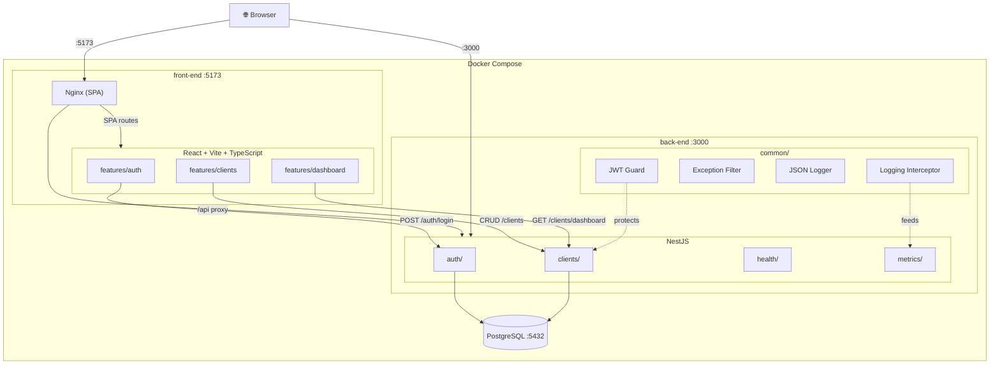

# Teddy Open Finance Challenge

MVP full-stack de um sistema de clientes com login, CRUD, listagem, detalhes e dashboard administrativo. Monorepo Nx com React + Vite no frontend e NestJS no backend, pronto para rodar localmente via Docker.

## Diagrama de arquitetura




## Escopo funcional

- Autenticação (e-mail/senha) com JWT
- CRUD de clientes com soft delete
- Dashboard: totais, últimos clientes e gráfico mensal
- Contador de acessos no detalhe do cliente
- Auditoria com timestamps (`createdAt`, `updatedAt`, `deletedAt`)

## Stack

### Frontend (`apps/front-end`)


| Lib                      | Uso                                   |
| ------------------------ | ------------------------------------- |
| React 19                 | UI com hooks e componentes funcionais |
| Vite                     | Build e dev server                    |
| TypeScript               | Tipagem estrita                       |
| React Hook Form          | Formulários com validação             |
| React Router             | Roteamento e URL state                |
| Recharts                 | Gráfico de barras no dashboard        |
| Tailwind CSS             | Estilização                           |
| Vitest + Testing Library | Testes de componente                  |


### Backend (`apps/back-end`)


| Lib                         | Uso                       |
| --------------------------- | ------------------------- |
| NestJS 11                   | Framework modular         |
| TypeORM                     | ORM com PostgreSQL        |
| PostgreSQL 16               | Banco de dados            |
| Passport + JWT              | Autenticação              |
| class-validator             | Validação de DTOs         |
| class-transformer           | Transformação de payloads |
| bcrypt                      | Hash de senhas            |
| Swagger (`@nestjs/swagger`) | Documentação de API       |
| Jest                        | Testes unitários          |


### Monorepo e qualidade


| Lib          | Uso                                     |
| ------------ | --------------------------------------- |
| Nx 20        | Monorepo, targets independentes por app |
| ESLint       | Linting                                 |
| Prettier     | Formatação                              |
| TypeScript 5 | Tipagem                                 |


## Estrutura de pastas

```
teddy-open-finance-challenge/
├── apps/
│   ├── back-end/
│   │   ├── src/
│   │   │   ├── auth/        Login, JWT strategy, guard, User entity
│   │   │   ├── clients/     CRUD, soft delete, view counter, dashboard stats
│   │   │   ├── health/      GET /healthz
│   │   │   ├── metrics/     GET /metrics (Prometheus)
│   │   │   ├── common/      Exception filter, guards, interceptors, JSON logger
│   │   │   ├── config/      Database e JWT config
│   │   │   └── migrations/  TypeORM migrations
│   │   ├── Dockerfile
│   │   ├── docker-compose.yml
│   │   └── .env.example
│   └── front-end/
│       ├── src/
│       │   ├── app/          Routing e providers
│       │   ├── features/
│       │   │   ├── auth/     Login, protected routes, auth context
│       │   │   ├── clients/  List, detail, create/edit form
│       │   │   └── dashboard/ Totals, latest clients, chart
│       │   └── shared/       API client, formatCurrency, formatDateTime
│       ├── Dockerfile
│       ├── docker-compose.yml
│       └── .env.example
├── docker-compose.yml        Stack completa (postgres + backend + frontend)
├── .env.example
├── .cursor/rules/               Regras persistentes para a AI
└── docs/
    ├── teddy-challenge-scope.md  Escopo do desafio
    ├── plan.md                   Plano de fases
    ├── ai-workflow.md            Fluxo de desenvolvimento com AI
    └── teddy-challenge-agents-setup.md  Definição dos agentes
```

## Pré-requisitos

- Docker e Docker Compose

## Como rodar

### Stack completa (recomendado)

```bash
cp .env.example .env
docker compose up --build
```

Aguarde os 3 containers subirem. O PostgreSQL precisa estar healthy antes do backend iniciar — o Docker Compose cuida disso automaticamente.


| Serviço      | URL                                                            |
| ------------ | -------------------------------------------------------------- |
| Frontend     | [http://localhost:5173](http://localhost:5173)                 |
| Backend API  | [http://localhost:3000](http://localhost:3000)                 |
| Swagger      | [http://localhost:3000/docs](http://localhost:3000/docs)       |
| Health check | [http://localhost:3000/healthz](http://localhost:3000/healthz) |
| Métricas     | [http://localhost:3000/metrics](http://localhost:3000/metrics) |


### Apps isolados

Cada app pode ser executado independentemente com seu próprio `docker-compose.yml`:

```bash
cd apps/back-end && docker compose up --build    # backend + postgres
cd apps/front-end && docker compose up --build   # frontend (requer backend rodando)
```

### Credenciais padrão


| Email             | Senha         |
| ----------------- | ------------- |
| `admin@teddy.com` | `password123` |


Usuário criado automaticamente via seed quando o banco está vazio. Além disso, 67 clientes de exemplo são inseridos automaticamente na primeira execução, com nomes, salários, valores de empresa e datas de cadastro variados.

## Modo de desenvolvimento

Para debugging, hot reload e desenvolvimento ativo:

```bash
npm install
cp .env.example .env
docker compose up -d postgres       # apenas o banco
npm run dev:back                     # backend com hot reload (terminal 1)
npm run dev:front                    # frontend com hot reload (terminal 2)
```

## Scripts disponíveis


| Comando                | Descrição                           |
| ---------------------- | ----------------------------------- |
| `npm run dev:front`    | Dev server do frontend (hot reload) |
| `npm run dev:back`     | Dev server do backend (hot reload)  |
| `npm run build:front`  | Build do frontend para produção     |
| `npm run build:back`   | Build do backend para produção      |
| `npm run test:front`   | Testes do frontend                  |
| `npm run test:back`    | Testes do backend                   |
| `npm run test`         | Todos os testes                     |
| `npm run lint`         | Lint de todos os projetos           |
| `npm run format`       | Formatar código                     |
| `npm run format:check` | Verificar formatação                |


## Endpoints da API


| Método | Rota                 | Auth | Descrição                     |
| ------ | -------------------- | ---- | ----------------------------- |
| POST   | `/auth/login`        | Não  | Autenticação (retorna JWT)    |
| GET    | `/clients`           | Sim  | Listar clientes               |
| POST   | `/clients`           | Sim  | Criar cliente                 |
| GET    | `/clients/dashboard` | Sim  | Stats do dashboard            |
| GET    | `/clients/:id`       | Sim  | Detalhe (incrementa contador) |
| PUT    | `/clients/:id`       | Sim  | Atualizar cliente             |
| DELETE | `/clients/:id`       | Sim  | Soft delete                   |
| GET    | `/healthz`           | Não  | Health check                  |
| GET    | `/metrics`           | Não  | Métricas Prometheus           |
| GET    | `/docs`              | Não  | Swagger                       |


## Credenciais padrão


| Email             | Senha         |
| ----------------- | ------------- |
| `admin@teddy.com` | `password123` |


Usuário criado automaticamente via seed quando o banco está vazio.

## Observabilidade

### Por que health, metrics, logs e testes são importantes

- **Health check** (`GET /healthz`) — permite que load balancers e orquestradores saibam se o serviço está vivo. Um health check rápido e determinístico evita direcionar tráfego para instâncias com falha.
- **Métricas** (`GET /metrics`) — em formato Prometheus, habilitam dashboards (Grafana) e alertas. Monitorar contagem de requests, erros, uptime e uso de memória ajuda a detectar degradação de performance antes que vire incidente.
- **Logs estruturados** (JSON) — tornam possível a agregação de logs (ELK, CloudWatch, Datadog). Logs legíveis por máquina com timestamp, level, context e message permitem busca, filtro e correlação entre serviços — essencial para debugging em produção.
- **Testes** (unitários, componente, integração) — dão confiança de que mudanças não quebram comportamento existente. Servem como documentação viva das regras de negócio e permitem refatoração segura. No CI/CD, testes são a barreira que impede código quebrado de chegar a produção.

## Testes

O projeto possui 4 camadas de testes:

| Tipo | Ferramenta | Escopo |
|---|---|---|
| **Unitário (backend)** | Jest | Services e controllers isolados |
| **Componente (frontend)** | Vitest + Testing Library | Componentes React com estados (loading, error, success, empty) |
| **E2E API (backend)** | Jest + supertest | Fluxo HTTP real: health, auth, CRUD, dashboard, 401 |
| **E2E Browser (frontend)** | Playwright | Fluxo completo no navegador: login, dashboard, CRUD de clientes |

### Comandos rápidos

| Comando | Descrição |
|---|---|
| `npm run test` | Todos os testes unitários e de componente |
| `npm run test:back` | Unitários do backend |
| `npm run test:front` | Componente do frontend |
| `npm run test:e2e:back` | E2E do backend (requer PostgreSQL rodando) |
| `npm run test:e2e:front` | E2E do frontend (requer stack completa rodando) |

Para detalhes de cobertura, cenários testados e passo a passo de cada tipo, veja o README de cada app:
- [Backend — Testes](./apps/back-end/README.md#testes)
- [Frontend — Testes](./apps/front-end/README.md#testes)

## Desenvolvimento assistido por AI

Este projeto foi construído com o apoio do [Cursor](https://cursor.com), um editor de código com inteligência artificial integrada. A AI não foi usada como gerador automático de código — ela atuou como um colaborador disciplinado dentro de um fluxo estruturado.

### Como funcionou na prática

O desenvolvimento seguiu um ciclo claro para cada fase do projeto:

1. **Planejar antes de codar** — a cada fase, o primeiro passo era ler o escopo do desafio, entender o que já existia e propor um plano mínimo. Nenhum código era gerado antes de um plano aprovado.
2. **Agentes especializados** — em vez de pedir tudo para um único assistente, o trabalho foi dividido entre agentes com papéis bem definidos: um para planejar, um para frontend, um para backend, um para infraestrutura e um para revisar o resultado contra o escopo.
3. **Regras persistentes** — o projeto mantém um conjunto de regras em `.cursor/rules/` que guiam o comportamento da AI: arquitetura, convenções de código, estrutura do monorepo, qualidade e operação. Essas regras garantem consistência mesmo entre sessões diferentes.
4. **Revisão antes de fechar** — ao final de cada fase, uma revisão compara a implementação com os requisitos do desafio para garantir que nada foi esquecido ou sobre-engenheirado.

Para mais detalhes sobre o fluxo, os agentes e as regras, veja `docs/ai-workflow.md`  e `docs/teddy-challenge-agents-setup.md`

## Escalabilidade (visão AWS)

Para produção em cloud, a arquitetura poderia ser implantada com:

- **Frontend**: S3 + CloudFront (CDN)
- **Backend**: ECS Fargate ou EKS com auto-scaling
- **Banco**: RDS PostgreSQL com Multi-AZ
- **Observabilidade**: CloudWatch Logs, X-Ray para tracing, métricas custom via Prometheus/Grafana
- **Auth**: manter JWT stateless, considerar integração com Cognito para cenários mais complexos

