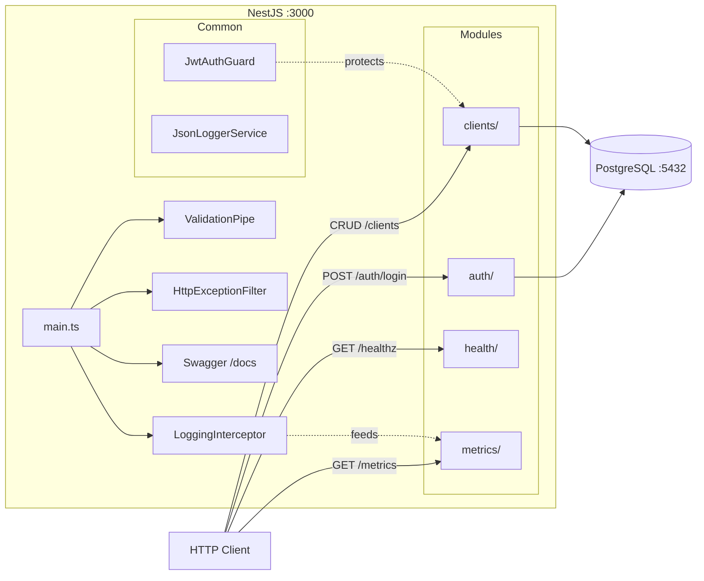

# Back-End — Teddy Open Finance

API NestJS modular com TypeORM + PostgreSQL, autenticação JWT, Swagger, soft delete e observabilidade.

## Arquitetura



## Stack

| Lib | Uso |
|---|---|
| NestJS 11 | Framework modular |
| TypeORM | ORM com PostgreSQL |
| PostgreSQL 16 | Banco de dados |
| Passport + JWT | Autenticação |
| class-validator | Validação de DTOs |
| class-transformer | Transformação de payloads |
| bcrypt | Hash de senhas |
| `@nestjs/swagger` | Documentação Swagger |
| Jest + `@nestjs/testing` | Testes unitários |

## Pré-requisitos

- Docker e Docker Compose
- Portas livres: 3000 (API), 5432 (PostgreSQL)

## Como rodar (passo a passo)

### 1. Configurar variáveis de ambiente

```bash
cp apps/back-end/.env.example apps/back-end/.env
```

### 2. Subir o backend com Docker

```bash
cd apps/back-end
docker compose up --build
```

Isso sobe PostgreSQL + backend em containers. As migrations rodam automaticamente e um usuário seed é criado.

### 3. Verificar que está rodando

```bash
# Health check
curl http://localhost:3000/healthz
# Deve retornar: {"status":"ok","timestamp":"..."}

# Swagger
# Abrir http://localhost:3000/docs no navegador

# Login
curl -X POST http://localhost:3000/auth/login \
  -H "Content-Type: application/json" \
  -d '{"email":"admin@teddy.com","password":"password123"}'
# Deve retornar: {"accessToken":"..."}
```

### Credenciais padrão

| Email | Senha |
|---|---|
| `admin@teddy.com` | `password123` |

## Modo de desenvolvimento

Para debugging, hot reload e acesso direto ao processo Node:

```bash
# Na raiz do monorepo
npm install
cp .env.example .env
docker compose up -d postgres   # apenas o banco
npm run dev:back                 # backend com hot reload
```

O servidor inicia em http://localhost:3000 com watch mode. Alterações no código reiniciam automaticamente.

## Módulos

| Módulo | Responsabilidade |
|---|---|
| `auth/` | Login, JWT strategy, guard, User entity, seed |
| `clients/` | CRUD com soft delete, view counter, dashboard stats |
| `health/` | `GET /healthz` |
| `metrics/` | `GET /metrics` (Prometheus) |
| `common/` | Exception filter, JWT guard, logging interceptor, JSON logger |
| `config/` | Database e JWT config centralizado |
| `migrations/` | Migrations explícitas (TypeORM) |

## Endpoints

| Método | Rota | Auth | Descrição |
|---|---|---|---|
| POST | `/auth/login` | Não | Autenticação |
| GET | `/clients` | Sim | Listar clientes |
| POST | `/clients` | Sim | Criar cliente |
| GET | `/clients/dashboard` | Sim | Stats do dashboard |
| GET | `/clients/:id` | Sim | Detalhe + contador de views |
| PUT | `/clients/:id` | Sim | Atualizar cliente |
| DELETE | `/clients/:id` | Sim | Soft delete |
| GET | `/healthz` | Não | Health check |
| GET | `/metrics` | Não | Métricas Prometheus |
| GET | `/docs` | Não | Swagger |

## Variáveis de ambiente

| Variável | Default | Descrição |
|---|---|---|
| `DATABASE_HOST` | `localhost` | Host do PostgreSQL |
| `DATABASE_PORT` | `5432` | Porta do PostgreSQL |
| `DATABASE_USER` | `teddy` | Usuário do banco |
| `DATABASE_PASSWORD` | `teddy` | Senha do banco |
| `DATABASE_NAME` | `teddy` | Nome do banco |
| `JWT_SECRET` | `change-me-in-production` | Secret do JWT |
| `JWT_EXPIRES_IN` | `1h` | Expiração do token |
| `BACKEND_PORT` | `3000` | Porta da API |

## Testes

```bash
npm run test:back
```

Testes unitários com Jest para services e controllers. Padrão Arrange-Act-Assert.
