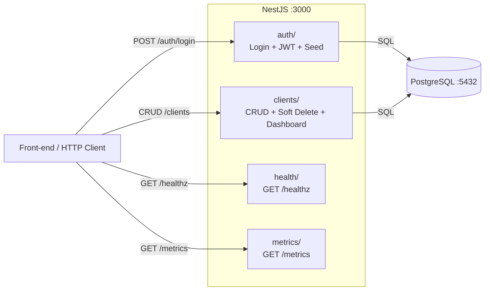

# Back-End — Teddy Open Finance

API NestJS modular com TypeORM + PostgreSQL, autenticação JWT, Swagger, soft delete e observabilidade.

## Arquitetura



Cada módulo é auto-contido com controller, service, DTOs e testes. Middleware global: `ValidationPipe`, `HttpExceptionFilter`, `LoggingInterceptor`, `JsonLoggerService`. O `JwtAuthGuard` é aplicado por controller nas rotas protegidas.

## Stack

| Lib | Uso |
|---|---|
| NestJS 11 | Framework modular |
| TypeORM | ORM com PostgreSQL |
| PostgreSQL 16 | Banco de dados |
| Passport + JWT | Autenticação |
| class-validator | Validação de DTOs |
| class-transformer | Transformação de payloads |
| bcrypt | Hash de senhas |
| `@nestjs/swagger` | Documentação Swagger |
| Jest + `@nestjs/testing` | Testes unitários |

## Pré-requisitos

- Docker e Docker Compose
- Portas livres: 3000 (API), 5432 (PostgreSQL)

## Como rodar (passo a passo)

### 1. Configurar variáveis de ambiente

```bash
cp apps/back-end/.env.example apps/back-end/.env
```

### 2. Subir o backend com Docker

```bash
cd apps/back-end
docker compose up --build
```

Isso sobe PostgreSQL + backend em containers. As migrations rodam automaticamente, um usuário seed é criado e 67 clientes de exemplo são inseridos.

### 3. Verificar que está rodando

```bash
# Health check
curl http://localhost:3000/healthz
# Deve retornar: {"status":"ok","timestamp":"..."}

# Swagger
# Abrir http://localhost:3000/docs no navegador

# Login
curl -X POST http://localhost:3000/auth/login \
  -H "Content-Type: application/json" \
  -d '{"email":"admin@teddy.com","password":"password123"}'
# Deve retornar: {"accessToken":"...","name":"Administrador"}
```

### Credenciais padrão

| Email | Senha |
|---|---|
| `admin@teddy.com` | `password123` |

## Modo de desenvolvimento

Para debugging, hot reload e acesso direto ao processo Node:

```bash
# Na raiz do monorepo
npm install
cp .env.example .env
docker compose up -d postgres   # apenas o banco
npm run dev:back                 # backend com hot reload
```

O servidor inicia em http://localhost:3000 com watch mode. Alterações no código reiniciam automaticamente.

## Módulos

| Módulo | Responsabilidade |
|---|---|
| `auth/` | Login, JWT strategy, guard, User entity (com name), seed |
| `clients/` | CRUD com soft delete, view counter, dashboard stats, seed de 67 clientes |
| `health/` | `GET /healthz` |
| `metrics/` | `GET /metrics` (Prometheus) |
| `common/` | Exception filter, JWT guard, logging interceptor, JSON logger |
| `config/` | Database e JWT config centralizado |
| `migrations/` | Migrations explícitas (TypeORM) |

## Endpoints

| Método | Rota | Auth | Descrição |
|---|---|---|---|
| POST | `/auth/login` | Não | Autenticação |
| GET | `/clients` | Sim | Listar clientes |
| POST | `/clients` | Sim | Criar cliente |
| GET | `/clients/dashboard` | Sim | Stats do dashboard |
| GET | `/clients/:id` | Sim | Detalhe + contador de views |
| PUT | `/clients/:id` | Sim | Atualizar cliente |
| DELETE | `/clients/:id` | Sim | Soft delete |
| GET | `/healthz` | Não | Health check |
| GET | `/metrics` | Não | Métricas Prometheus |
| GET | `/docs` | Não | Swagger |

## Variáveis de ambiente

| Variável | Default | Descrição |
|---|---|---|
| `DATABASE_HOST` | `localhost` | Host do PostgreSQL |
| `DATABASE_PORT` | `5432` | Porta do PostgreSQL |
| `DATABASE_USER` | `teddy` | Usuário do banco |
| `DATABASE_PASSWORD` | `teddy` | Senha do banco |
| `DATABASE_NAME` | `teddy` | Nome do banco |
| `JWT_SECRET` | `change-me-in-production` | Secret do JWT |
| `JWT_EXPIRES_IN` | `1h` | Expiração do token |
| `BACKEND_PORT` | `3000` | Porta da API |

## Testes

### Testes unitários

Testes isolados de services e controllers com mocks. Padrão Arrange-Act-Assert.

```bash
npm run test:back
```

**Cobertura:**

**26 testes em 6 arquivos:**

| Arquivo | # | Cenários |
|---|---|---|
| `auth.service.spec.ts` | 5 | Login com credenciais válidas retorna JWT, usuário inexistente (401), senha inválida (401), seed cria usuário se vazio, seed não recria se já existe |
| `auth.controller.spec.ts` | 2 | Delegação ao service, propagação de exceções |
| `clients.service.spec.ts` | 9 | Criar, listar com total, listar vazio, detalhe com viewCount, NotFoundException no detalhe, atualizar, NotFoundException no update, soft delete, NotFoundException no delete |
| `clients.controller.spec.ts` | 6 | Delegação de create, findAll, findOne, update, remove, getDashboardStats |
| `health.controller.spec.ts` | 1 | Resposta com status ok e timestamp |
| `metrics.service.spec.ts` | 3 | Formato Prometheus válido, incremento de requests, incremento de erros |

### Testes E2E (API)

Testes de integração que sobem a aplicação NestJS real com supertest e testam o fluxo HTTP completo contra o PostgreSQL.

**Pré-requisito:** PostgreSQL rodando (via `docker compose up -d postgres`).

```bash
npm run test:e2e:back
```

**17 testes em 1 arquivo (`app.e2e-spec.ts`):**

| Grupo | # | Cenários |
|---|---|---|
| Health & Metrics | 2 | (1) GET /healthz retorna status ok + timestamp, (2) GET /metrics retorna texto Prometheus com HELP/TYPE |
| Auth | 3 | (1) Login válido retorna JWT + name "Administrador", (2) Login com senha errada retorna 401, (3) Login com body inválido retorna 400 |
| Clients CRUD | 8 | (1) GET /clients sem token retorna 401, (2) GET /clients com token retorna lista paginada, (3) POST /clients cria cliente, (4) POST /clients com body inválido retorna 400, (5) GET /clients/:id retorna detalhe com viewCount 1, (6) GET /clients/:id novamente retorna viewCount 2, (7) PUT /clients/:id atualiza nome, (8) GET /clients/:id inexistente retorna 404 |
| Soft delete | 2 | (1) DELETE /clients/:id retorna 204, (2) GET /clients/:id após delete retorna 404 |
| Dashboard | 2 | (1) GET /clients/dashboard retorna totais + latestClients + chartData, (2) GET /clients/dashboard sem token retorna 401 |

## CI

Pipeline dedicado via GitHub Actions (`.github/workflows/backend.yml`), acionado em push e pull request na branch `main` quando arquivos em `apps/back-end/**` são alterados.

**Steps:** `npm ci` → `nx lint back-end` → `nx test back-end` (26 unitários) → `test:e2e:back` (17 E2E) → `nx build back-end`

O pipeline sobe um service container PostgreSQL 16 para executar os testes E2E contra a API real com supertest. Todas as 4 etapas (lint, unitários, E2E, build) precisam passar para o pipeline ficar verde.

### Pre-push hook

O hook `.githooks/pre-push` executa os testes unitários e E2E do backend automaticamente antes de cada `git push`. Se o PostgreSQL não estiver rodando, o push é bloqueado — suba o banco com `docker compose up -d postgres` antes de fazer push.
