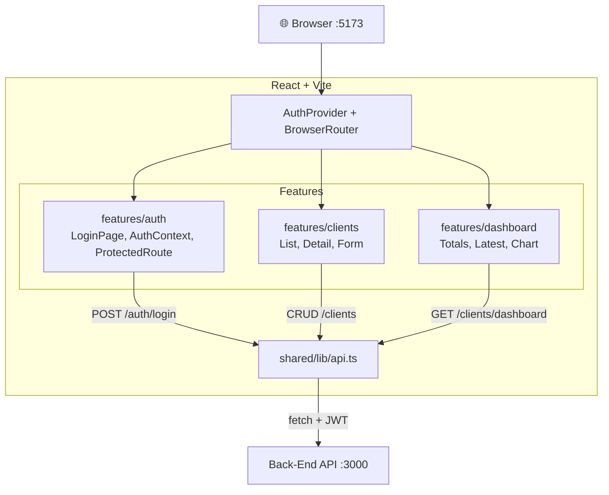

# Front-End — Teddy Open Finance

SPA React + Vite + TypeScript com React Hook Form, Recharts e Tailwind CSS.

## Arquitetura



## Stack

| Lib | Uso |
|---|---|
| React 19 | UI com hooks e componentes funcionais |
| Vite | Build e dev server |
| TypeScript | Tipagem estrita |
| React Hook Form | Formulários com validação |
| React Router | Roteamento e URL state |
| Recharts | Gráfico de barras no dashboard |
| Tailwind CSS | Estilização e responsividade |
| Vitest + Testing Library | Testes de componente |

## Pré-requisitos

- Docker e Docker Compose
- Backend rodando em http://localhost:3000 (siga o [README do back-end](../back-end/README.md) primeiro)
- Porta 5173 livre

## Como rodar (passo a passo)

### 1. Garantir que o backend está rodando

O frontend depende da API para login, CRUD e dashboard. Suba o backend antes:

```bash
cd apps/back-end
docker compose up --build
```

### 2. Configurar variáveis de ambiente

```bash
cp apps/front-end/.env.example apps/front-end/.env
```

### 3. Subir o frontend com Docker

```bash
cd apps/front-end
docker compose up --build
```

O frontend fica disponível em http://localhost:5173 via Nginx.

### 4. Verificar que está rodando

1. Abrir http://localhost:5173 no navegador
2. Você será redirecionado para `/login`
3. Entrar com `admin@teddy.com` / `password123`
4. Após login, o dashboard deve carregar

## Modo de desenvolvimento

Para debugging, hot reload e acesso ao Vite dev server:

```bash
# Na raiz do monorepo
npm install
cp .env.example .env
npm run dev:front   # Vite dev server com hot reload
```

O dev server inicia em http://localhost:5173. O Vite proxy redireciona chamadas à API para http://localhost:3000 automaticamente. Requer o backend rodando (via Docker ou `npm run dev:back`).

## Features

| Feature | Descrição |
|---|---|
| `features/auth` | Login com React Hook Form, auth context, protected routes |
| `features/clients` | Lista, detalhe (com contador), create/edit form |
| `features/dashboard` | Cards de totais, tabela de últimos clientes, gráfico mensal |

## Rotas

| Rota | Descrição | Auth |
|---|---|---|
| `/login` | Página de login | Não |
| `/dashboard` | Dashboard com totais e gráfico | Sim |
| `/clients` | Lista de clientes | Sim |
| `/clients/new` | Cadastro de cliente | Sim |
| `/clients/:id` | Detalhe com contador de views | Sim |
| `/clients/:id/edit` | Edição de cliente | Sim |

## Variáveis de ambiente

| Variável | Default | Descrição |
|---|---|---|
| `VITE_API_URL` | `http://localhost:3000` | URL da API backend |

## Testes

```bash
npm run test:front
```

Testes de componente com Vitest + Testing Library. Cobertura de estados: loading, error, success e empty.
