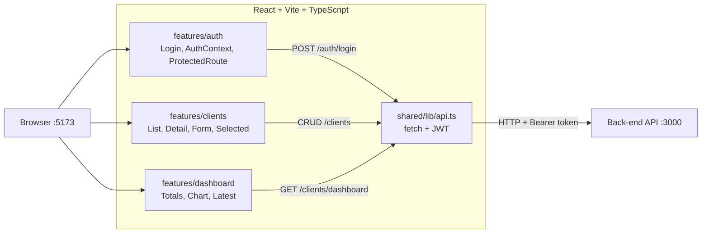

# Front-End — Teddy Open Finance

SPA React + Vite + TypeScript com React Hook Form, Recharts e Tailwind CSS.

## Arquitetura



## Stack

| Lib | Uso |
|---|---|
| React 19 | UI com hooks e componentes funcionais |
| Vite | Build e dev server |
| TypeScript | Tipagem estrita |
| React Hook Form | Formulários com validação |
| React Router | Roteamento e URL state |
| Recharts | Gráfico de barras no dashboard |
| Tailwind CSS | Estilização e responsividade |
| Vitest + Testing Library | Testes de componente |

## Pré-requisitos

- Docker e Docker Compose
- Backend rodando em http://localhost:3000 (siga o [README do back-end](../back-end/README.md) primeiro)
- Porta 5173 livre

## Como rodar (passo a passo)

### 1. Garantir que o backend está rodando

O frontend depende da API para login, CRUD e dashboard. Suba o backend antes:

```bash
cd apps/back-end
docker compose up --build
```

### 2. Configurar variáveis de ambiente

```bash
cp apps/front-end/.env.example apps/front-end/.env
```

### 3. Subir o frontend com Docker

```bash
cd apps/front-end
docker compose up --build
```

O frontend fica disponível em http://localhost:5173 via Nginx.

### 4. Verificar que está rodando

1. Abrir http://localhost:5173 no navegador
2. Você será redirecionado para `/login`
3. Entrar com `admin@teddy.com` / `password123`
4. Após login, o dashboard deve carregar

## Modo de desenvolvimento

Para debugging, hot reload e acesso ao Vite dev server:

```bash
# Na raiz do monorepo
npm install
cp .env.example .env
npm run dev:front   # Vite dev server com hot reload
```

O dev server inicia em http://localhost:5173. O Vite proxy redireciona chamadas à API para http://localhost:3000 automaticamente. Requer o backend rodando (via Docker ou `npm run dev:back`).

## Features

| Feature | Descrição |
|---|---|
| `features/auth` | Login com React Hook Form, auth context, protected routes |
| `features/clients` | Lista, detalhe (com contador), create/edit form (modal), clientes selecionados |
| `features/dashboard` | Cards de totais, tabela de últimos clientes, gráfico mensal |

## Rotas

| Rota | Descrição | Auth |
|---|---|---|
| `/login` | Página de login | Não |
| `/dashboard` | Dashboard com totais e gráfico | Sim |
| `/clients` | Lista de clientes (criar/editar via modal) | Sim |
| `/clients/selected` | Clientes selecionados | Sim |
| `/clients/:id` | Detalhe com contador de views | Sim |

## Variáveis de ambiente

| Variável | Default | Descrição |
|---|---|---|
| `VITE_API_URL` | `http://localhost:3000` | URL da API backend |

## Testes

### Testes de componente

Testes de componentes React com Vitest + Testing Library. Cobrem estados de loading, error, success e empty.

```bash
npm run test:front
```

**16 testes em 5 arquivos:**

| Arquivo | # | Cenários |
|---|---|---|
| `login-page.test.tsx` | 3 | (1) Formulário renderizado com campos e botão, (2) Validação de campos vazios no submit, (3) Validação de senha com menos de 6 caracteres |
| `clients-list-page.test.tsx` | 4 | (1) Estado de loading, (2) Erro com botão de retry, (3) Estado vazio, (4) Grid de cards com contagem |
| `client-detail-page.test.tsx` | 3 | (1) Estado de loading, (2) Estado de erro, (3) Detalhe com contador de visualizações |
| `client-form-page.test.tsx` | 2 | (1) Formulário de criação com 3 campos, (2) Validação de nome obrigatório |
| `dashboard-page.test.tsx` | 4 | (1) Estado de loading, (2) Estado de erro, (3) Estado vazio com zeros, (4) Totais e tabela de últimos clientes |

### Testes E2E (Browser)

Testes end-to-end com Playwright que abrem o Chromium e navegam pela aplicação real.

**Pré-requisitos:**
1. Stack completa rodando (`docker compose up --build` ou dev servers)
2. Playwright instalado (`npx playwright install chromium`)

```bash
npm run test:e2e:front
```

**13 testes em 3 arquivos:**

| Arquivo | # | Cenários |
|---|---|---|
| `e2e/auth.spec.ts` | 4 | (1) Redirect para /login sem auth, (2) Mensagem "sessão expirada" ao ser redirecionado, (3) Login válido redireciona para /dashboard e exibe nome, (4) Validação de campos vazios mostra erros |
| `e2e/dashboard.spec.ts` | 5 | (1) Card "Total de clientes" visível, (2) Card "Soma de valor das empresas" visível, (3) Seção "Clientes por mês" (gráfico), (4) Tabela "Últimos 10 clientes", (5) Botão "Ver todos" navega para /clients |
| `e2e/clients.spec.ts` | 4 | (1) Lista de cards com contagem, (2) Criar cliente via modal com máscara R$, (3) Editar cliente via modal, (4) Excluir cliente com confirmação e mensagem de sucesso |
