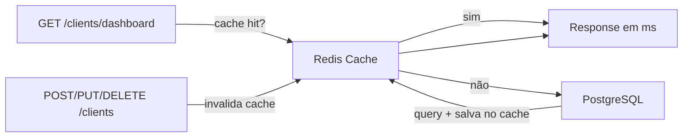

# Redis Cache — Proposta de Implementação

## Por que não foi implementado no MVP

O escopo do desafio menciona Redis 6379 como **opcional** na arquitetura local. A decisão de não incluí-lo no MVP foi consciente:

1. **Volume de dados**: com 67 clientes, as queries agregadas do dashboard executam em milissegundos — cache seria otimização prematura
2. **Complexidade operacional**: adicionar Redis ao Docker Compose, configurar fallback para ambientes sem Redis (como o free tier do Render), e gerenciar invalidação aumenta a superfície de manutenção sem benefício proporcional para o MVP
3. **Escopo do desafio**: o requisito é explicitamente opcional. Priorizar os requisitos obrigatórios e diferenciais (E2E, CI/CD, observabilidade) entrega mais valor para a avaliação

A arquitetura está preparada para receber Redis sem mudanças estruturais — o plano abaixo descreve exatamente como.

## Onde o Redis faria diferença

O endpoint `GET /clients/dashboard` é o candidato natural. Ele executa **3 queries agregadas** ao PostgreSQL em cada chamada:

1. `COUNT(*)` + `SUM(companyValue)` — totais
2. `SELECT ... ORDER BY createdAt DESC LIMIT 10` — últimos clientes
3. `GROUP BY TO_CHAR(createdAt, 'YYYY-MM')` — dados do gráfico mensal

Com milhares de clientes e múltiplos usuários simultâneos, essas queries se tornam o primeiro gargalo.

## Fluxo proposto



**Cache hit**: o dashboard é servido diretamente do Redis em milissegundos, sem tocar o PostgreSQL.

**Cache miss**: as queries rodam normalmente, o resultado é salvo no Redis com TTL de 60 segundos, e a resposta é retornada.

**Invalidação**: operações de escrita (`create`, `update`, `remove`) deletam a chave de cache após sucesso, garantindo que o próximo request ao dashboard traga dados atualizados.

## Como implementar

### 1. Dependências

```bash
npm install @nestjs/cache-manager cache-manager cache-manager-redis-store
```

- `@nestjs/cache-manager` — módulo oficial do NestJS para cache
- `cache-manager` — core de cache com suporte a múltiplos stores
- `cache-manager-redis-store` — driver Redis para o cache-manager

### 2. Infraestrutura Docker

Adicionar service Redis nos `docker-compose.yml` (raiz e `apps/back-end`):

```yaml
redis:
  image: redis:7-alpine
  ports:
    - '6379:6379'
  healthcheck:
    test: ['CMD', 'redis-cli', 'ping']
    interval: 5s
    timeout: 3s
    retries: 5
```

O backend passa a depender de `redis` além de `postgres`.

### 3. Variáveis de ambiente

Adicionar aos `.env.example`:

```
REDIS_URL=redis://localhost:6379
```

### 4. Configuração do módulo de cache

Criar `apps/back-end/src/config/cache.config.ts`:

```typescript
import { CacheModuleOptions } from '@nestjs/cache-manager';
import * as redisStore from 'cache-manager-redis-store';

const DEFAULT_TTL_SECONDS = 60;

export function getCacheConfig(): CacheModuleOptions {
  const redisUrl = process.env['REDIS_URL'];

  if (!redisUrl) {
    return { ttl: DEFAULT_TTL_SECONDS };
  }

  return {
    store: redisStore,
    url: redisUrl,
    ttl: DEFAULT_TTL_SECONDS,
  };
}
```

Se `REDIS_URL` não estiver definido, o cache usa store in-memory (graceful degradation).

### 5. Registrar no AppModule

```typescript
import { CacheModule } from '@nestjs/cache-manager';
import { getCacheConfig } from './config/cache.config';

@Module({
  imports: [
    CacheModule.register(getCacheConfig()),
    // ... demais imports
  ],
})
export class AppModule {}
```

### 6. Aplicar no ClientsService

```typescript
import { CACHE_MANAGER } from '@nestjs/cache-manager';
import { Cache } from 'cache-manager';

const DASHBOARD_CACHE_KEY = 'dashboard';

@Injectable()
export class ClientsService {
  constructor(
    @InjectRepository(Client)
    private readonly clientRepository: Repository<Client>,
    @Inject(CACHE_MANAGER)
    private readonly cache: Cache,
  ) {}

  async getDashboardStats(): Promise<DashboardResponseDto> {
    const cached = await this.cache.get<DashboardResponseDto>(DASHBOARD_CACHE_KEY);
    if (cached) return cached;

    // ... queries existentes ao PostgreSQL ...

    await this.cache.set(DASHBOARD_CACHE_KEY, result);
    return result;
  }

  async create(dto: CreateClientDto): Promise<ClientResponseDto> {
    // ... lógica existente ...
    await this.cache.del(DASHBOARD_CACHE_KEY);
    return this.toResponse(saved);
  }

  // Mesmo padrão para update() e remove()
}
```

### 7. Testes

Adicionar ao `clients.service.spec.ts`:

- **Cache hit**: mock do `cache.get` retorna dados → service não chama o repository
- **Cache miss**: mock do `cache.get` retorna null → service faz query e chama `cache.set`
- **Invalidação**: `create`/`update`/`remove` chamam `cache.del` após sucesso

## O que não muda

- **Frontend** — nenhuma alteração. O contrato da API permanece idêntico.
- **Endpoints** — mesma interface, mesmos DTOs, mesmos status codes.
- **Sem Redis disponível** — fallback para cache in-memory. A aplicação funciona normalmente.

## Considerações para produção

| Aspecto | Decisão |
|---|---|
| **Free tier (Render)** | Render não oferece Redis managed no free tier. O fallback in-memory garante que a aplicação funciona sem Redis. |
| **TTL** | 60 segundos é conservador. Em cenários com escrita rara e leitura frequente, pode ser aumentado. |
| **Escalabilidade** | Com múltiplas instâncias do backend (HPA), Redis centralizado garante que todas as instâncias compartilham o mesmo cache. Cache in-memory seria por instância. |
| **Monitoramento** | O endpoint `GET /metrics` pode incluir métricas de cache hit/miss rate para visibilidade operacional. |
